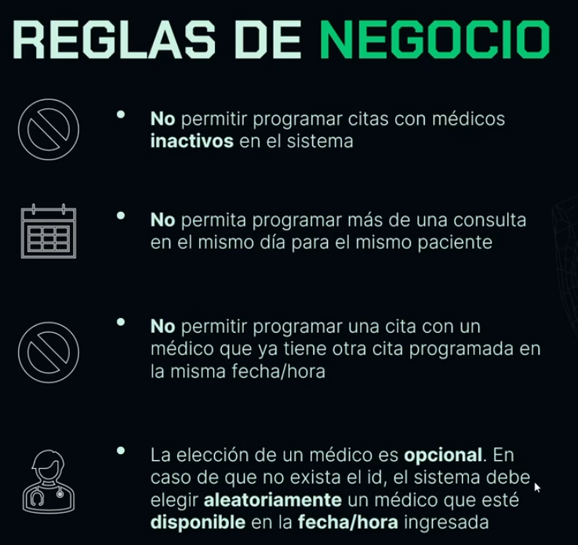
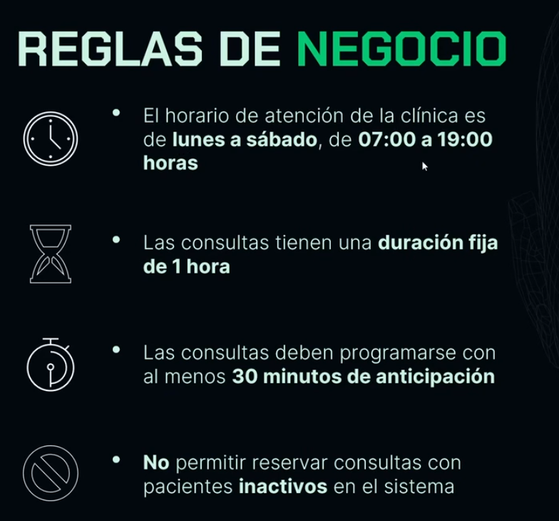
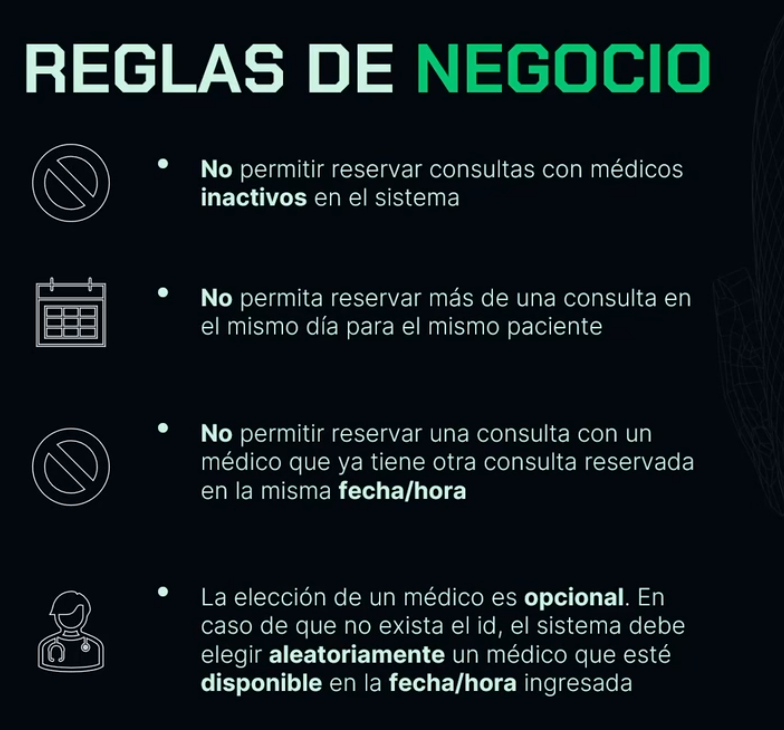
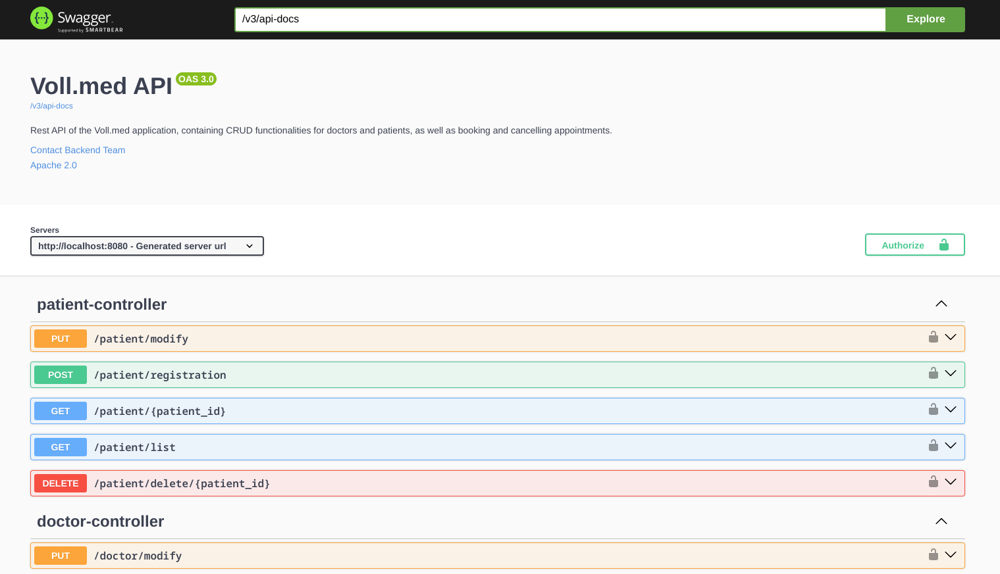

# REST API Clinica Voll

# Indice
- [Documentacion de la API.](#documentacion-de-la-api)
- [Descripcion.](#descripcion)
- [Desafios del proyecto.](#desafios-que-se-presentaron-en-la-creacion-del-proyecto)
- [Stack tecnologico.](#stack-tecnologico)
- [Seguimiento del proyecto.](#seguimiento-del-proyecto)

### Documentacion de la API:
Link: 

### Descripcion:
Este proyecto es una API REST diseñada para una clínica que permite la gestión
de médicos, pacientes y consultas, creada como proyecto final de uno de los cursos de
la especializacion en backend con Java y Spring framework de ONE - Oracle Next Education. 

Fue desarrollada en Java con Spring Boot, base de datos en MySQL y Maven 
como gestor de dependencias.

La API cuenta con funciones de seguridad como autenticacion y autorizacion de
usuarios usando JSON Web Tokens de la libreria Auth0.

- Proceso de autenticacion en la API:
  
    

- Funcionamiento de los filtros para interceptar las solicitudes:
  
    

- Proceso de autorizacion de usuarios en la API:
  
    

Tambien cuenta con multiples validaciones para las reglas de negocio, como verificacion de fechas,
validez de los tokens y de los datos enviados por el usuario, esto para asegurar que
no se permitan datos incorrectos, incompletos o invalidos.

Para generar la documentacion de la API utilice SpringDoc - OpenApi y asi generarla
de forma automatica para evitar errores, ademas que esta libreria nos brinda tambien
la generacion de un bonito frontend para su presentacion.

En la creacion del proyecto se hizo enfasis en las buenas practicas para la 
creacion de APIs REST, como la arquitectura orientada al dominio, implementacion 
de patrones de diseno, creacion de migraciones para la base de datos con flyway y uso 
de frameworks y librerias para generar codigo repetitivo(Lombok), entre otros, 
para garantizar la seguridad, escalabilidad y facil mantenimiento.

Este proyecto es una muestra de todo el ciclo de desarrollo de software, desde entender
los requerimientos hasta que la aplicacion es llevada a produccion.

### Desafios que se presentaron en la creacion del proyecto:
Durante la creacion de este proyecto enfrente desafios como la ejecucion de
los test "unitarios", porque, en el curso se aseguraba que todos los tests que
estabamos realizando eran tests "unitarios", pero cuando quize preparar mi aplicacion
para enviar a produccion, me encontre con varios errores al momento de generar
el archivo JAR porque queria hacerlo, sin empaquetar los perfiles application-dev.properties y
application-test.properties y crear un perfil diferente para produccion,
donde se siguieran las buenas practicas para estar seguro de hacer un deploy seguro y eficiente,
pero como los tests se ejecutaban en un ambiente de pruebas, y Maven ejecuta
la aplicacion y los tests para verificar el funcionamiento antes de generar el JAR, me daba 
varios errores utilizando el perfil de produccion.

Despues de varias horas leyendo documentacion e investigando en internet me di cuenta
que un par de los tests que estabamos haciendo no eran propiamente tests "unitarios",
sino que eran tests de "integracion" parcial y por ello me daba error cuando Maven
ejecutaba los tests con las credenciales de la base de datos del perfil de produccion que las obtenia
a partir de variables de entorno.

Esto logre solucionarlo leyendo documentacion, buscando en foros, preguntale a una
IA y ejecutando pruebas manuales.

Tambien, tuve algunos problemas con la generacion de consultas a la 
base de datos utilizando JPQL para no escribir consultas SQL nativas,
que logre solucionar con exito accediento a la documentacion oficial y con ayuda
de una IA para detectar los errores mas rapido y ahorrar tiempo.

### Stack tecnologico:
Los detalles del stack tecnológico que utilice son los siguientes:

Lenguaje de Programación: Java
 
Framework: Spring
 
Gestor de Dependencias: Maven
 
Base de Datos: MySQL

Dependencias utilizadas:

Spring Data JPA: Para gestionar el acceso y manipulación de la base de datos.
  
Spring Validation: Para validar los datos de entrada de forma sencilla.
  
Spring Starter Web: Permite la ejecución de aplicaciones web.
  
Spring Security: Para gestionar la autenticacion y autorizacion de usuarios
que realizan solicitudes a la API.
  
Devtools: Facilita el desarrollo en tiempo real, mostrando los cambios sin
necesidad de reiniciar el servidor.
  
Lombok: Simplifica la generación de código repetitivo como constructores,
getters y setters.
  
Flyway: Para realizar migraciones de bases de datos.

Este proyecto demuestra la integración de múltiples componentes de Spring
Framework para desarrollar una API REST robusta, eficiente y segura, proporcionando
una solución completa para la gestión de una clínica médica.

### Seguimiento del proyecto:
1. Crear un proyecto Spring Boot usando el sitio web Spring Initializr;

2. Importar el proyecto a IntelliJ y ejecutar una aplicación Spring Boot 
a través de la clase que contiene el método main;

3. Crear una clase Controller y mapear una URL en él usando las 
anotaciones @RestController y @RequestMapping;

4. Realizar una solicitud de prueba en el navegador accediendo a la 
URL mapeada en el Controller.

5. Mapear solicitudes POST en una clase Controller;
   
6. Enviar solicitudes POST a la API usando Insomnia;
   
7. Enviar datos a la API en formato JSON;
   
8. Utilizar la anotación @RequestBody para recibir datos del cuerpo de 
la solicitud en un parámetro en el Controller;
   
9. Use el patrón de diseño DTO (Data Transfer Object), a través de Java
Records, para representar los datos recibidos en una solicitud POST.

10. Agregar nuevas dependencias en el proyecto;

11. Asignar una entidad JPA y crear una interfaz de Repositorio para ella;

12. Utilizar Flyway como herramienta de migración de proyectos;

13. Realice validaciones con Bean Validation usando algunas de sus 
anotaciones, como @NotBlank.

14. Usar la anotación @GetMapping para mapear métodos en los Controllers
que producen datos;

15. Usar la interfaz Pageable de Spring para realizar consultas con paginación;

16. Controlar la paginación y el ordenamiento de los datos devueltos por la API 
con los parámetros page, size y sort;

17. Configurar el proyecto para que los comandos SQL se visualicen en la consola.

18. Mapear solicitudes PUT con la anotación @PutMapping;

19. Escribir un código para actualizar la información de un registro en la base de datos;

20. Mapear solicitudes DELETE con la anotación @DeleteMapping;

21. Mapear parámetros dinámicos en la URL con la anotación @PathVariable;

22. Implementar el concepto de exclusión lógica utilizando un atributo booleano.
    
23. Usar la clase ResponseEntity, de Spring, para personalizar los retornos de los 
métodos de una clase Controller;
    
24. Modificar el código HTTP devuelto en las respuestas de la API;
    
25. Agregar encabezados a las respuestas de la API;
    
26. Utilice los códigos HTTP más apropiados para cada operación realizada en la API.

27. 27.Crear una clase para aislar el manejo de excepciones de API, utilizando la 
anotación @RestControllerAdvice;
    
28. Utilizar la anotación @ExceptionHandler, de Spring, para indicar qué excepción debe 
capturar un determinado método de la clase de manejo de errores;
    
29. Manejar errores 404 (Not Found) en la clase de manejo de errores;
    
30. Manejar errores 400 (Bad Request), para errores de validación de Bean Validation, 
en la clase de manejo de errores;
    
31. Simplificar el JSON devuelto por la API en casos de error de validación de Bean Validation.

32. Identificar cómo funciona el proceso de autenticación y autorización en una API Rest;

33. Agregar Spring Security al proyecto;

34. Cómo funciona el comportamiento padrón de Spring Security en una aplicación;

35. Implementar el proceso de autenticación en la API, de forma Stateless, 
utilizando clases y configuraciones de Spring Security.

36. Agregar la biblioteca Auth0 java-jwt como una dependencia del proyecto;
    
37. Utilizar esta biblioteca para generar un token en la API;
    
38. Inyectar una propiedad del archivo application.properties en una clase administrada
por Spring, usando la anotación @Value;
    
39. Devolver un token generado en la API cuando un usuario se autentica.

40. Los Filters funcionan en una solicitud;
    
41. Implementar un Filter creando una clase que herede de la clase OncePerRequestFilter de Spring;
    
42. Utilizar la biblioteca Auth0 java-jwt para validar los tokens recibidos en la API;
    
43. Realizar el proceso de autenticación de la solicitud, utilizando la clase SecurityContextHolder de Spring;
    
44. Liberar y restringir solicitudes, según la URL y el verbo del protocolo HTTP.

45. Implementar una nueva funcionalidad en el proyecto;
    
46. Evaluar cuándo es necesario crear una clase Service en la aplicación;
    
47. Crear una clase Service, con el objetivo de aislar códigos de reglas de negocio, utilizando la anotación @Service;
    
48. Implementar un algoritmo para la funcionalidad de reserva de consultas;
    
49. Realizar validaciones de integridad de las informaciones que llegan a la API;
    
50. Implementar una consulta JPQL (Java Persistence Query Language) compleja en una interfaz repository, 
utilizando para eso la anotación @Query.

51. Aislar los códigos de validaciones de reglas de negocio en clases separadas, utilizando en ellas la anotación 
@Component de Spring;
    
52. Finalizar la implementación del algoritmo de reserva de consultas;
    
53. Utilizar los principios SOLID para dejar el código de la funcionalidad de reserva de consultas más fácil de 
entender, evolucionar y testar.

54. Agregar la biblioteca SpringDoc en el proyecto para que haga la generación automatizada de la documentación de la API;
    
55. Analizar la documentación de SpringDoc para entender cómo realizar su configuración en un proyecto;
    
56. Acceder a las direcciones que disponibilizan la documentación de la API en los formatos yaml y html;
    
57. Utilizar Swagger UI para visualizar y probar una API Rest;
    
58. Configurar el JWT en la documentación generada por SpringDoc.

59. Escribir tests automatizados en una aplicación con Spring Boot;
    
60. Escribir tests automatizados de una interfaz Repository, siguiendo la estrategia de usar la misma base de datos que
la aplicación utiliza;
    
61. Sobrescribir propiedades del archivo application.properties, creando otro archivo llamado application-test.properties
que sea cargado solo al ejecutar los tests, utilizando para ello la anotación @ActiveProfiles;
    
62. Escribir tests automatizados de una clase Controller, utilizando la clase MockMvc para simular requests en la API;
    
63. Testar escenarios de error 400 y código 200 en el test de una clase Controller.

64. Utilizar archivos de propiedades específicos para cada profile, modificando en cada archivo las propiedades que 
necesitan ser modificadas.
    
65. Configurar informaciones sensibles de la aplicación, como datos de acceso a la base de datos, a través de variables 
de ambiente;
    
66. Realizar el build del proyecto a través de Maven.
    
67. Ejecutar la aplicación vía terminal, con el comando java -jar, pasando las variables de ambiente como parámetro.