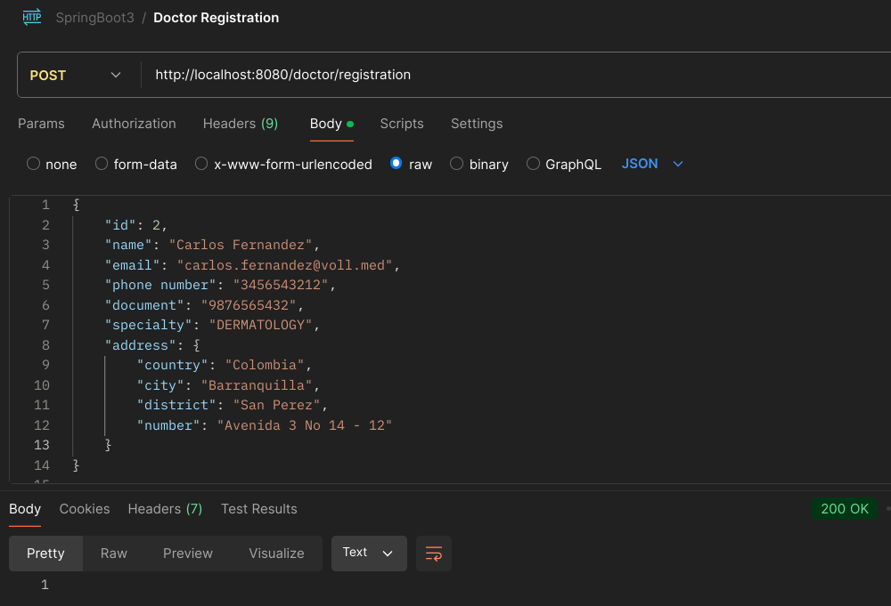
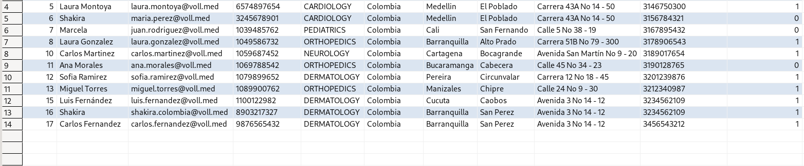
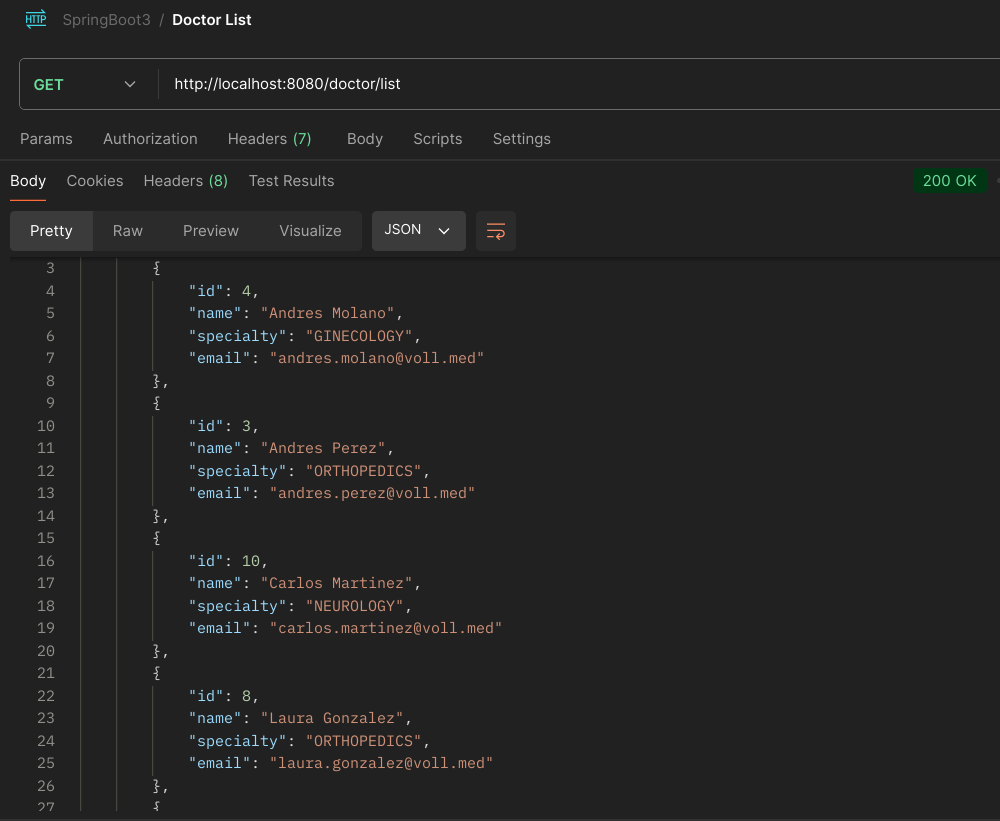
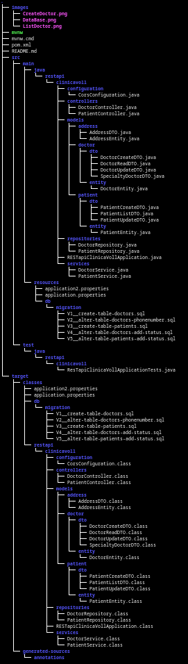

# REST API Clinica Voll

- Creacion de una entidad por medio del endpoint correspondiente:

  
- Registros en la base de datos:

### Descripcion:
Esta aplicación web está diseñada para una clínica y permite la gestión
integral de médicos, pacientes y consultas, ofreciendo todas las operaciones 
comunes para la persistencia de datos.

En este proyecto, utilicé Spring Initializr para crear un proyecto con 
Spring Boot, aprovechando su configuración automática.

La aplicación permite realizar todas las operaciones CRUD (Crear, Leer, 
Actualizar, Eliminar) necesarias para la gestión de la información en la clínica. 
Esto incluye:

Gestión de Médicos: Permite agregar, actualizar, listar y eliminar registros de médicos.
  
Gestión de Pacientes: Facilita la administración de los datos de los pacientes.
  
Gestión de Consultas: Permite registrar y gestionar las consultas médicas realizadas.
  
- Realizando una solitud GET para obtener los medicos registrados:

Los detalles del stack tecnológico son los siguientes:

Lenguaje de Programación: Java
 
Gestor de Dependencias: Maven
 
Base de Datos: MySQL

Dependencias y Frameworks:

Spring Data JPA: Facilita el acceso y manipulación de la base de datos.
  
Spring Validation: Para validar los datos de entrada de forma sencilla.
  
Spring Starter Web: Permite la ejecución de aplicaciones web.
  
Devtools: Facilita el desarrollo en tiempo real, mostrando los cambios sin 
necesidad de reiniciar el servidor.
  
Lombok: Simplifica la generación de código repetitivo como constructores, 
getters y setters.
  
Flyway: Para realizar migraciones de bases de datos.

Este proyecto demuestra la integración de múltiples componentes de Spring 
Framework para desarrollar una API REST robusta y eficiente, proporcionando 
una solución completa para la gestión de una clínica médica.
  
- Estructura del proyecto:

### Seguimiento de lo realizado:
1. Crear un proyecto Spring Boot usando el sitio web Spring Initializr;

2. Importar el proyecto a IntelliJ y ejecutar una aplicación Spring Boot 
a través de la clase que contiene el método main;

3. Crear una clase Controller y mapear una URL en él usando las 
anotaciones @RestController y @RequestMapping;

4. Realizar una solicitud de prueba en el navegador accediendo a la 
URL mapeada en el Controller.

5. Mapear solicitudes POST en una clase Controller;
   
6. Enviar solicitudes POST a la API usando Insomnia;
   
7. Enviar datos a la API en formato JSON;
   
8. Utilizar la anotación @RequestBody para recibir datos del cuerpo de 
la solicitud en un parámetro en el Controller;
   
9. Use el patrón de diseño DTO (Data Transfer Object), a través de Java
Records, para representar los datos recibidos en una solicitud POST.

10. Agregar nuevas dependencias en el proyecto;

11. Asignar una entidad JPA y crear una interfaz de Repositorio para ella;

12. Utilizar Flyway como herramienta de migración de proyectos;

13. Realice validaciones con Bean Validation usando algunas de sus 
anotaciones, como @NotBlank.

14. Usar la anotación @GetMapping para mapear métodos en los Controllers
que producen datos;

15. Usar la interfaz Pageable de Spring para realizar consultas con paginación;

16. Controlar la paginación y el ordenamiento de los datos devueltos por la API 
con los parámetros page, size y sort;

17. Configurar el proyecto para que los comandos SQL se visualicen en la consola.

18. Mapear solicitudes PUT con la anotación @PutMapping;

19. Escribir un código para actualizar la información de un registro en la base de datos;

20. Mapear solicitudes DELETE con la anotación @DeleteMapping;

21. Mapear parámetros dinámicos en la URL con la anotación @PathVariable;

22. Implementar el concepto de exclusión lógica utilizando un atributo booleano.
    
23. Usar la clase ResponseEntity, de Spring, para personalizar los retornos de los 
métodos de una clase Controller;
    
24. Modificar el código HTTP devuelto en las respuestas de la API;
    
25. Agregar encabezados a las respuestas de la API;
    
26. Utilice los códigos HTTP más apropiados para cada operación realizada en la API.