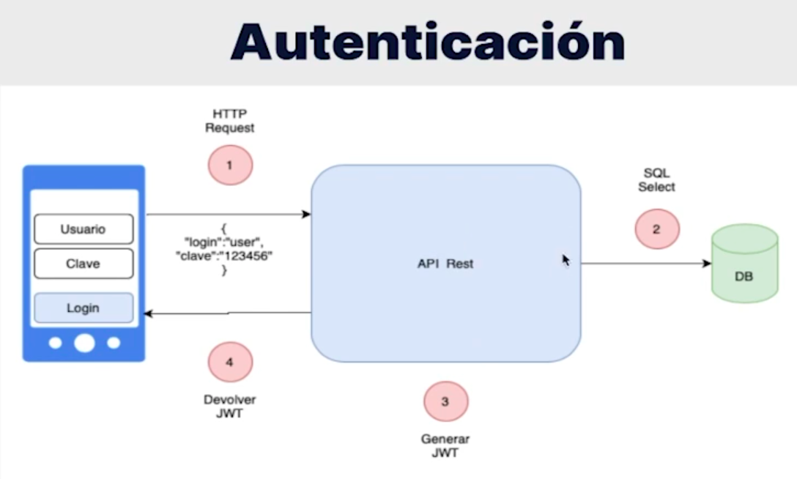
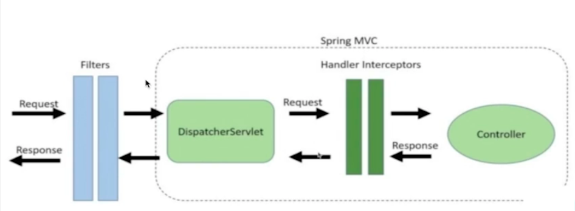
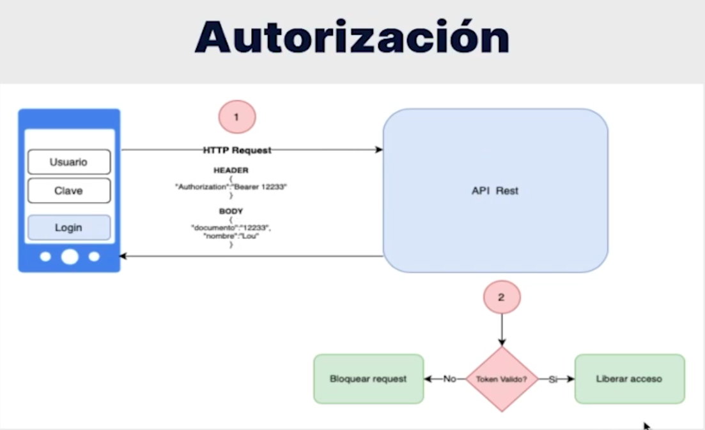

# REST API Clinica Voll

- Proceso de autenticacion en la API:
  
    

- Funcionamiento de los filtros para interceptar las solicitudes
  y verificar si llegan con un token valido:
  
    

- Proceso de autorizacion de usuarios en la API:
  
    

- Creacion de una entidad por medio del endpoint correspondiente:

    

- Registros en la base de datos:

### Descripcion:
Esta API está diseñada para una clínica y permite la gestión
integral de médicos, pacientes y consultas, ofreciendo todas las operaciones 
comunes para la persistencia de datos con autenticacion y autorizacion de usuarios
utilizando los modulos que nos proporciona Spring framework para gestionar estas tareas.

En la creacion del proyecto se hace enfasis en las buenas practicas para
la creacion de APIs REST para garantizar la seguridad, escalabilidad y facil mantenimiento.

La aplicación permite realizar todas las operaciones CRUD (Crear, Leer, 
Actualizar, Eliminar) necesarias para la gestión de la información en la clínica. 
Esto incluye:

Gestión de Médicos: Permite agregar, actualizar, listar y eliminar registros de médicos.
  
Gestión de Pacientes: Facilita la administración de los datos de los pacientes ejecutando 
las mismas operaciones disponibles con los medicos.
  

- Realizando una solitud GET para obtener los medicos registrados:

Los detalles del stack tecnológico son los siguientes:

Lenguaje de Programación: Java
 
Framework: Spring
 
Gestor de Dependencias: Maven
 
Base de Datos: MySQL

Dependencias utilizadas:

Spring Data JPA: Para gestionar el acceso y manipulación de la base de datos.
  
Spring Validation: Para validar los datos de entrada de forma sencilla.
  
Spring Starter Web: Permite la ejecución de aplicaciones web.
  
Spring Security: Para gestionar la autenticacion y autorizacion de usuarios 
que realizan solicitudes a la API.
  
Devtools: Facilita el desarrollo en tiempo real, mostrando los cambios sin 
necesidad de reiniciar el servidor.
  
Lombok: Simplifica la generación de código repetitivo como constructores, 
getters y setters.
  
Flyway: Para realizar migraciones de bases de datos.

Este proyecto demuestra la integración de múltiples componentes de Spring 
Framework para desarrollar una API REST robusta, eficiente y segura, proporcionando 
una solución completa para la gestión de una clínica médica.
  
- Estructura del proyecto:

### Seguimiento de lo realizado:
1. Crear un proyecto Spring Boot usando el sitio web Spring Initializr;

2. Importar el proyecto a IntelliJ y ejecutar una aplicación Spring Boot 
a través de la clase que contiene el método main;

3. Crear una clase Controller y mapear una URL en él usando las 
anotaciones @RestController y @RequestMapping;

4. Realizar una solicitud de prueba en el navegador accediendo a la 
URL mapeada en el Controller.

5. Mapear solicitudes POST en una clase Controller;
   
6. Enviar solicitudes POST a la API usando Insomnia;
   
7. Enviar datos a la API en formato JSON;
   
8. Utilizar la anotación @RequestBody para recibir datos del cuerpo de 
la solicitud en un parámetro en el Controller;
   
9. Use el patrón de diseño DTO (Data Transfer Object), a través de Java
Records, para representar los datos recibidos en una solicitud POST.

10. Agregar nuevas dependencias en el proyecto;

11. Asignar una entidad JPA y crear una interfaz de Repositorio para ella;

12. Utilizar Flyway como herramienta de migración de proyectos;

13. Realice validaciones con Bean Validation usando algunas de sus 
anotaciones, como @NotBlank.

14. Usar la anotación @GetMapping para mapear métodos en los Controllers
que producen datos;

15. Usar la interfaz Pageable de Spring para realizar consultas con paginación;

16. Controlar la paginación y el ordenamiento de los datos devueltos por la API 
con los parámetros page, size y sort;

17. Configurar el proyecto para que los comandos SQL se visualicen en la consola.

18. Mapear solicitudes PUT con la anotación @PutMapping;

19. Escribir un código para actualizar la información de un registro en la base de datos;

20. Mapear solicitudes DELETE con la anotación @DeleteMapping;

21. Mapear parámetros dinámicos en la URL con la anotación @PathVariable;

22. Implementar el concepto de exclusión lógica utilizando un atributo booleano.
    
23. Usar la clase ResponseEntity, de Spring, para personalizar los retornos de los 
métodos de una clase Controller;
    
24. Modificar el código HTTP devuelto en las respuestas de la API;
    
25. Agregar encabezados a las respuestas de la API;
    
26. Utilice los códigos HTTP más apropiados para cada operación realizada en la API.

27. 27.Crear una clase para aislar el manejo de excepciones de API, utilizando la 
anotación @RestControllerAdvice;
    
28. Utilizar la anotación @ExceptionHandler, de Spring, para indicar qué excepción debe 
capturar un determinado método de la clase de manejo de errores;
    
29. Manejar errores 404 (Not Found) en la clase de manejo de errores;
    
30. Manejar errores 400 (Bad Request), para errores de validación de Bean Validation, 
en la clase de manejo de errores;
    
31. Simplificar el JSON devuelto por la API en casos de error de validación de Bean Validation.

32. Identificar cómo funciona el proceso de autenticación y autorización en una API Rest;

33. Agregar Spring Security al proyecto;

34. Cómo funciona el comportamiento padrón de Spring Security en una aplicación;

35. Implementar el proceso de autenticación en la API, de forma Stateless, 
utilizando clases y configuraciones de Spring Security.

36. Agregar la biblioteca Auth0 java-jwt como una dependencia del proyecto;
    
37. Utilizar esta biblioteca para generar un token en la API;
    
38. Inyectar una propiedad del archivo application.properties en una clase administrada
por Spring, usando la anotación @Value;
    
39. Devolver un token generado en la API cuando un usuario se autentica.

40. Los Filters funcionan en una solicitud;
    
41. Implementar un Filter creando una clase que herede de la clase OncePerRequestFilter de Spring;
    
42. Utilizar la biblioteca Auth0 java-jwt para validar los tokens recibidos en la API;
    
43. Realizar el proceso de autenticación de la solicitud, utilizando la clase SecurityContextHolder de Spring;
    
44. Liberar y restringir solicitudes, según la URL y el verbo del protocolo HTTP.

45. Implementar una nueva funcionalidad en el proyecto;
    
46. Evaluar cuándo es necesario crear una clase Service en la aplicación;
    
47. Crear una clase Service, con el objetivo de aislar códigos de reglas de negocio, utilizando la anotación @Service;
    
48. Implementar un algoritmo para la funcionalidad de reserva de consultas;
    
49. Realizar validaciones de integridad de las informaciones que llegan a la API;
    
50. Implementar una consulta JPQL (Java Persistence Query Language) compleja en una interfaz repository, 
utilizando para eso la anotación @Query.